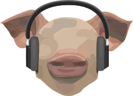

# Just Good (JG) Music

## What is JGMusic

Just Good Music (JGMusic) is a general purpose advanced, multi-featured Discord music bot. It implements features that many free and open source Discord music bots have but not all existent in a single Discord bot.

To get started, see [Setup](./setup.md).

## Features

Below are some features that makes JGMusic different than other free Discord music bots. Some features even take inspiration from [VLC Media Player](https://www.videolan.org/vlc/):

- [x] Forward and reverse seeking, implemented from scratch
- [x] Sleep timer to disconnect after a period of time
- [x] Autoshuffler
- [x] Jumping to timestamps in songs
- [x] Effects like playback speed and pitch changing
- [x] Filters like daycore and nightcore
- [x] Basic storage of playlists
- [x] Documentation catered towards basic users and developers

And much more!

## History

Just Good Music, originally named JoshGone Music, was created as a joke. After getting tired of a friend's Discord bot (with music playing features) constantly going offline when he stopped hosting it, I forked his repo to host my own copy locally to listen to music whenever I had Discord open. One may argue I could just open up Spotify or YouTube music, but once I got used to the commands, playing music like this became very fast and my goto method? I also had the freedom to create whatever music playing features I wanted. The fork already gave me a good template to work with. One thing led to another, features started piling on top of one another, and here we are.

## Design Philosophy

The JGMusic interface is intentionally kept minimal, making an attempt to only use ASCII characters for any sort of display, information panels, or information messages. No need for anything fancy if something simple does the trick. See the [`;info`](./additional.md#info) command for an example.

Additionally, Discord's [Slash Commands](https://support.discord.com/hc/en-us/articles/1500000368501-Slash-Commands-FAQ) are clunky and awkward. the keyboard placement of the `/` requires a relatively far reach compared to JGMusic's `;` prefix. Although Slash Commands might be intuitive to use for new users, prefixed commands are not that difficult to learn and are much faster to fire once fluency is established. This bot will *NEVER* make use of slash commands.

## Final Remarks

As of now, JGMusic may be considered fairly bare-bones in there sense that there was no emphasis on role management. For example, other bots might have a "DJ role" that grants access to certain commands for users with the role. It may even be considered a template, containing functionality for core music playing features.

Additionally, there were no plans to host this bot online either.

These considerations may be subject to change in the future.
