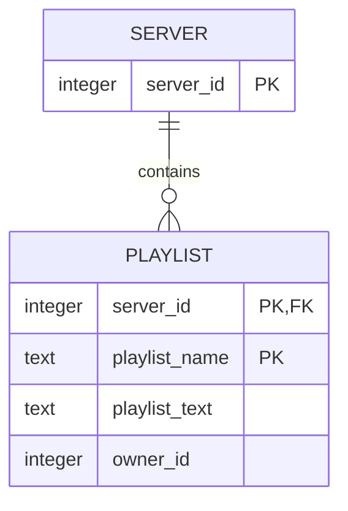

## Overview

This section contains an overview of commands located in `jgm/extensions/admin.py` and `jgm/extensions/database.py`. Which are owner-only commands that interface more closely with the bot's code.

Additionally, this section also contains information on tools the bot offers that developers might find useful, like a REPL or database management details.

Since these commands are not meant to be used by the average user, there is no point in having an alias or cooldown.

First, common administrative commands:

| Command with Arguments | Description |
|-|-|
| [`;ctx_`](#adminctx_) | Adds a context instance to the bot |
| [`;extensions`](#adminextensions) | Lists all loaded extensions |
| [`;load`](#adminload) `<module>` | Loads an extension/cog |
| [`;reload`](#adminreload) `<module>` | Reloads an extension/cog |
| [`;shutdown`](#adminshutdown) | Shuts the bot down |
| [`;unload`](#adminunload) `<module>` | Unloads an extension/cog |
| [`;reinit`](#databasereinit) | Reinitializes the bot for a server |

## Admin Commands

### [`admin.ctx_`](#adminctx_)

<sup>
<a href="https://github.com/Togohogo1/joshgone-music/releases/tag/v1.0.0" target="_blank", title="Initial Release">:octicons-rocket-24: v2.0.0</a>&nbsp;&nbsp;&nbsp;
<a href="https://github.com/Togohogo1/joshgone-music/releases/tag/v1.0.0" target="_blank", title="Latest Update">:octicons-tag-24: v2.0.0</a>
</sup>

Adds a context instance to the bot

Adding a [context](https://discordpy.readthedocs.io/en/stable/ext/commands/api.html?highlight=discord%20ext%20commands%20context%20context#context) instance to the global [bot](https://discordpy.readthedocs.io/en/stable/ext/commands/api.html?highlight=bot#bot) object requires manually running this command, which is useful for debugging in the [REPL](#the-repl).

### [`admin.extensions`](#adminextensions)

<sup>
<a href="https://github.com/Togohogo1/joshgone-music/releases/tag/v1.0.0" target="_blank", title="Initial Release">:octicons-rocket-24: v1.0.0</a>&nbsp;&nbsp;&nbsp;
<a href="https://github.com/Togohogo1/joshgone-music/releases/tag/v1.0.0" target="_blank", title="Latest Update">:octicons-tag-24: v2.0.0</a>
</sup>

Lists all loaded extensions

Those that are loaded on startup are:

- `jgm.extensions.admin`
- `jgm.extensions.playlists`
- `jgm.extensions.music`
- `jgm.extensions.database`
- `jgm.extensions.info`
- `jgm.extensions.repl`[^1]

[^1]: See the [REPL](#the-repl) section

### [`admin.load`](#adminload)

<sup>
<a href="https://github.com/Togohogo1/joshgone-music/releases/tag/v1.0.0" target="_blank", title="Initial Release">:octicons-rocket-24: v1.0.0</a>&nbsp;&nbsp;&nbsp;
<a href="https://github.com/Togohogo1/joshgone-music/releases/tag/v1.0.0" target="_blank", title="Latest Update">:octicons-tag-24: v1.0.0</a>
</sup>

Loads an extension/cog

Loads with the [`load_extension`](https://discordpy.readthedocs.io/en/stable/ext/commands/api.html?highlight=load_extension#discord.ext.commands.Bot.load_extension) coroutine function.

#### Arguments

- `module` – The extension/cog

### [`admin.reload`](#adminreload)

<sup>
<a href="https://github.com/Togohogo1/joshgone-music/releases/tag/v1.0.0" target="_blank", title="Initial Release">:octicons-rocket-24: v1.0.0</a>&nbsp;&nbsp;&nbsp;
<a href="https://github.com/Togohogo1/joshgone-music/releases/tag/v1.0.0" target="_blank", title="Latest Update">:octicons-tag-24: v1.0.0</a>
</sup>

Reloads an extension/cog

Reloads with the [`reload_extension`](https://discordpy.readthedocs.io/en/stable/ext/commands/api.html?highlight=load_extension#discord.ext.commands.Bot.reload_extension) coroutine function.

This is almost the same as an unload followed by a load. See the [`reload_extension`](https://discordpy.readthedocs.io/en/stable/ext/commands/api.html?highlight=load_extension#discord.ext.commands.Bot.reload_extension) documentation for more information.

#### Arguments

- `module` – The extension/cog

??? note

    Running `;reload admin` on the bot will work, but running `;unload admin` followed by `;load admin` will not.

??? warning

    Although the bot was designed to support functionality to the fullest across cog loads and unloads (mainly for use during development, when a code modification is to be seen in action without needing to restart a bot), There is a chance that something might break after a reload.

### [`admin.shutdown`](#adminshutdown)

<sup>
<a href="https://github.com/Togohogo1/joshgone-music/releases/tag/v1.0.0" target="_blank", title="Initial Release">:octicons-rocket-24: v1.0.0</a>&nbsp;&nbsp;&nbsp;
<a href="https://github.com/Togohogo1/joshgone-music/releases/tag/v1.0.0" target="_blank", title="Latest Update">:octicons-tag-24: v1.0.0</a>
</sup>

Shuts the bot down

Shuts the bot down by awaiting the [close()](https://discordpy.readthedocs.io/en/stable/ext/commands/api.html?highlight=bot%20close#discord.ext.commands.Bot.close) coroutine.

### [`admin.unload`](#adminunload)

<sup>
<a href="https://github.com/Togohogo1/joshgone-music/releases/tag/v1.0.0" target="_blank", title="Initial Release">:octicons-rocket-24: v1.0.0</a>&nbsp;&nbsp;&nbsp;
<a href="https://github.com/Togohogo1/joshgone-music/releases/tag/v1.0.0" target="_blank", title="Latest Update">:octicons-tag-24: v1.0.0</a>
</sup>

Unloads an extension/cog

Unloads with the [`unload_extension`](https://discordpy.readthedocs.io/en/stable/ext/commands/api.html?highlight=load_extension#discord.ext.commands.Bot.reload_extension) coroutine function.

#### Arguments

- `module` – The extension/cog

### [`database.reinit`](#databasereinit)

<sup>
<a href="https://github.com/Togohogo1/joshgone-music/releases/tag/v1.0.0" target="_blank", title="Initial Release">:octicons-rocket-24: v1.0.0</a>&nbsp;&nbsp;&nbsp;
<a href="https://github.com/Togohogo1/joshgone-music/releases/tag/v1.0.0" target="_blank", title="Latest Update">:octicons-tag-24: v2.0.0</a>
</sup>

Reinitializes the bot for a server

To maintain the functionality of commands that require database reading like the [`;playlist`](./playlists.md) commands, the server (guild) ID must exist under the `server` TABLE in the `jgmusic.db` database file.

This command removes the current server the bot is in from the table (or does nothing if it doesn't exist), and adds it back in, thereby "reinitializing" it.

## Database Information

Building off of [More Setup](./setup.md#more-setup), just Good Music uses [SQLite](https://www.sqlite.org/index.html) for database management. In the code, asynchronous database management is handled with [aiosqlite](https://aiosqlite.omnilib.dev/en/stable/). Database migrations are handled with [yoyo](https://aiosqlite.omnilib.dev/en/stable/).

Although the database for playlists is unlikely to evolve much, yoyo is a tool available for developers to take care of any database migrations if necessary. A list of common yoyo commands can be found [here](https://ollycope.com/software/yoyo/latest/#command-line-usage). Remember to append <code>hatch run&nbsp;</code> before every command.

Migration files are located in `./migrations`. More information regarding them can be found [here](https://ollycope.com/software/yoyo/latest/#command-line-usage). The purposes of this bot only requires one with simple apply and rollback steps.

A server may contain 0 or more playlists but a *specific* playlist can come from one and only one server. A playlist cannot exist without a server. These relationships are outlined below in the entity-relation diagram. For more information, see the [mermaid.js](https://mermaid.js.org/syntax/entityRelationshipDiagram.html) docs:



In the database, a servers TABLE stores all the server entities and a playlists TABLE stores all the playlist entities.

## The REPL

All the bot's functionality can be replicated via command line with an REPL (read-evaluate-print-loop), which is an incredibly useful tool for debugging the bot. The REPL is an adaptation of Python 3.9's [asyncio REPL](https://github.com/python/cpython/blob/3.9/Lib/asyncio/__main__.py), using a subclass of Python's builtin `code` module's [`InteractiveConsole`](https://docs.python.org/3/library/code.html#code.InteractiveConsole) class.

On startup, the REPL cog is loaded only if the `JGM_REPL` environment variable is set to 1 (see [Setup](./setup.md) for more details).

??? warning

    There is an issue with the REPL not being able to register the arrow keys (hence getting previous lines do not work). See this [Stack Overflow](https://stackoverflow.com/questions/68664269/why-doesnt-pressing-the-up-arrow-get-the-previous-command-in-nested-processes) post for more details

As soon as `hatch run jgm` is run in the command prompt a message along the lines of the text below will be printed and the REPL will then be ready for use (yes, instead of the classic `>>>`, pigs are used instead):

```text
Loaded admin
Loaded playlists
Loaded music
Loaded database
Loaded info
Loaded repl
All extensions loaded: [admin, playlists, music, database, info, repl]
JoshGone logged on as JGMusic#7263.
SQLite version is 3.37.2.
Initializing bot `owner_id` [Workaround to potential bug].
asyncio REPL 3.10.12 (main, Nov 20 2023, 15:14:05) [GCC 11.4.0] on linux
Use "await" directly instead of "asyncio.run()".
Type "help", "copyright", "credits" or "license" for more information.
🐷🐷🐷 |import asyncio
🐷🐷🐷 |
```

Before using the REPL, it is useful to run `;ctx_` on the bot for access to the Context object.

=== "REPL"

    ```text
    🐷🐷🐷 |bot.ctx_
    <discord.ext.commands.context.Context object at 0x7f09dc7290c0>
    🐷🐷🐷 |ctx = bot.ctx_
    ```

=== "Commands"

    ```text
    bot.ctx_
    ctx = bot.ctx_
    ```

??? note

    All REPL examples below assumes the examples above a specific example were run

All accessible instance variables and functions in the bot:

=== "REPL"

    ```text
    🐷🐷🐷 |dir(bot)
    ['_BotBase__cogs', '_BotBase__extensions', '_BotBase__tree', '__aenter__', '__aexit__', '__class__', '__class_getitem__', '__delattr__', '__dict__', '__dir__', '__doc__', '__eq__', '__format__', '__ge__', '__getattribute__', '__gt__', '__hash__', '__init__', '__init_subclass__', '__le__', '__lt__', '__module__', '__ne__', '__new__', '__orig_bases__', '__parameters__', '__reduce__', '__reduce_ex__', '__repr__', '__setattr__', '__sizeof__', '__slots__', '__str__', '__subclasshook__', '__weakref__', '_after_invoke', '_application', '_async_setup_hook', '_before_invoke', '_call_before_identify_hook', '_call_module_finalizers', '_check_once', '_checks', '_closed', '_connection', '_enable_debug_events', '_get_state', '_get_websocket', '_handle_ready', '_handlers', '_help_command', '_hooks', '_is_protocol', '_listeners', '_load_from_module_spec', '_music_advance_queue', '_music_data', '_music_old_ytdl_bug_report_message', '_ready', '_remove_module_references', '_resolve_name', '_run_event', '_schedule_event', 'activity', 'add_check', 'add_cog', 'add_command', 'add_listener', 'add_view', 'after_invoke', 'all_commands', 'allowed_mentions', 'application', 'application_flags', 'application_id', 'application_info', 'before_identify_hook', 'before_invoke', 'cached_messages', 'can_run', 'case_insensitive', 'change_presence', 'check', 'check_once', 'clear', 'close', 'cogs', 'command', 'command_prefix', 'commands', 'connect', 'create_dm', 'create_guild', 'ctx_', 'delete_invite', 'description', 'dispatch', 'emojis', 'event', 'extensions', 'extra_events', 'fetch_channel', 'fetch_guild', 'fetch_guilds', 'fetch_invite', 'fetch_premium_sticker_packs', 'fetch_stage_instance', 'fetch_sticker', 'fetch_template', 'fetch_user', 'fetch_webhook', 'fetch_widget', 'get_all_channels', 'get_all_members', 'get_channel', 'get_cog', 'get_command', 'get_context', 'get_emoji', 'get_guild', 'get_partial_messageable', 'get_prefix', 'get_stage_instance', 'get_sticker', 'get_user', 'group', 'guilds', 'help_command', 'http', 'hybrid_command', 'hybrid_group', 'intents', 'invoke', 'is_closed', 'is_owner', 'is_ready', 'is_ws_ratelimited', 'latency', 'listen', 'load_extension', 'login', 'loop', 'on_command_error', 'on_error', 'on_message', 'owner_id', 'owner_ids', 'persistent_views', 'private_channels', 'process_commands', 'recursively_remove_all_commands', 'reload_extension', 'remove_check', 'remove_cog', 'remove_command', 'remove_listener', 'run', 'setup_hook', 'shard_count', 'shard_id', 'start', 'status', 'stickers', 'strip_after_prefix', 'tree', 'unload_extension', 'user', 'users', 'voice_clients', 'wait_for', 'wait_until_ready', 'walk_commands', 'wrap_async', 'ws']
    ```

=== "Commands"

    ```py
    dir(bot)
    ```

Next, getting a extension/cog and printing out its instance variables and function:

=== "REPL"

    ```text
    🐷🐷🐷 |m = bot.cogs["Music"]
    🐷🐷🐷 |dir(m)
    ['_DEFAULT_YTDL_OPTS', '_FFMPEG_FILTER_DICT', '__annotations__', '__class__', '__cog_app_commands__', '__cog_app_commands_group__', '__cog_commands__', '__cog_description__', '__cog_group_auto_locale_strings__', '__cog_group_description__', '__cog_group_extras__', '__cog_group_name__', '__cog_group_nsfw__', '__cog_is_app_commands_group__', '__cog_listeners__', '__cog_name__', '__cog_settings__', '__delattr__', '__dict__', '__dir__', '__discord_app_commands_error_handler__', '__doc__', '__eq__', '__format__', '__ge__', '__getattribute__', '__gt__', '__hash__', '__init__', '__init_subclass__', '__le__', '__lt__', '__module__', '__ne__', '__new__', '__reduce__', '__reduce_ex__', '__repr__', '__setattr__', '__sizeof__', '__str__', '__subclasshook__', '__weakref__', '_batch_add', '_eject', '_get_overridden_method', '_inject', '_play_local', '_play_raw', '_play_stream', 'advance_queue', 'advance_task', 'advancer', 'app_command', 'apply_filter', 'autoshuffle', 'autoshuffler', 'bot', 'bot_check', 'bot_check_once', 'cancel', 'check_connected', 'check_playing', 'clear', 'cog_after_invoke', 'cog_app_command_error', 'cog_before_invoke', 'cog_check', 'cog_command_error', 'cog_load', 'cog_unload', 'current', 'data', 'daycore', 'description', 'ensure_connected', 'fast_forward', 'filter_dict', 'forceskip', 'get_app_commands', 'get_commands', 'get_info', 'get_listeners', 'handle_advance', 'handle_advances', 'has_app_command_error_handler', 'has_error_handler', 'info', 'info_global', 'interaction_check', 'join', 'jump', 'leave', 'listener', 'local', 'local_prepend', 'loop', 'move', 'nightcore', 'normal', 'normalize_index', 'on_advancer_cancel', 'pause', 'pitch', 'playback_history', 'playback_history_clear', 'player_from_url', 'playlist_link', 'pop_info', 'qualified_name', 'queue', 'remove', 'reschedule', 'resume', 'rewind', 'schedule', 'shuffle', 'shuffle_helper', 'skip', 'sleep_in', 'sleep_task', 'speed', 'stream', 'stream_prepend', 'uri_validator', 'volume', 'walk_app_commands', 'walk_commands', 'ytdl_opts']
    ```

=== "Commands"

    ```py
    m = bot.cogs["Music"]
    dir(m)
    ```

After joining a voice channel, we run a command from the cog:

=== "REPL"

    ```text
    🐷🐷🐷 |await m.stream(ctx, url="Anomalie Velours")
    ```

=== "Commands"

    ```py
    await m.stream(ctx, url="Anomalie Velours")
    ```

Alternatively, there is another way to get the Context variable:

=== "REPL"

    ```text
    🐷🐷🐷 |server = discord.utils.get(bot.guilds, name=server_name)
    🐷🐷🐷 |chat = discord.utils.get(server.text_channels, name=text_channel_name)
    🐷🐷🐷 |chat_message = await chat.fetch_message(message_id)
    🐷🐷🐷 |ctx = await bot.get_context(chat_message)
    🐷🐷🐷 |msg = await ctx.send("Just Good Music")
    ```

=== "Commands"

    ```py
    # Placeholders to be replaced
    server_name = ...
    text_channel_name = ...
    message_id = ...
    # Code in the example
    server = discord.utils.get(bot.guilds, name=server_name)
    chat = discord.utils.get(server.text_channels, name=text_channel_name)
    chat_message = await chat.fetch_message(message_id)
    ctx = await bot.get_context(chat_message)
    msg = await ctx.send("Just Good Music")
    ```

Some basic Python code:

=== "REPL"

    ```text
    🐷🐷🐷 |for i in range(10):
    🐽🐽🐽 :        print(i)
    🐽🐽🐽 :
    0
    1
    2
    3
    4
    5
    6
    7
    8
    9
    🐷🐷🐷 |
    ```

=== "Commands"

    ```py
    for i in range(10):
        print(i)
    ```

Of course, there are much more complex things one can do with the REPL. This section only highlights how to get started with it.
