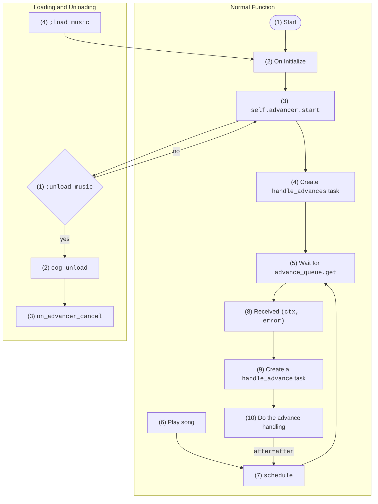

*The information may be useful for future developers looking to dig more into the inner working of the bot and for my own reference. Understanding this section requires knowledge on Python's `asyncio` library.*

## Flowchart

(write this last) To ensure a working queueing system that works across servers, JG Music uses a somewhat complicated music advancing method with status flags. The most important process of JGMusic (the core) is the music advancing system
The music advancement process in short, ensures that once a song finishes playing, the next one gets played right after. (maybe come back to this later too)

The following flowchart depicts a high-level overview of the music advancing system, including a small section on what happens during [`load`]()s/[`unload`]()s.

All flowchart nodes are labelled with a number to be elaborated further on in the next sections.



## Normal Function in Detail

??? note

    Mentions of `music.py`, `self`, or `Music` will refer to the file `jgm/extensions/music`, unless stated otherwise.

### (1) Start

The entry point of JG Music is `jgmusic.py`. When `hatch run jgm` is executed in the terminal, a series of functions are called which eventually leads to `jgm/extensions/music.Music.setup` which is a special discord.py function that executes when an extension gets loaded with [`load_extension`](https://discordpy.readthedocs.io/en/stable/ext/commands/api.html?highlight=load_extension#discord.ext.commands.Bot.load_extension):

### (2) On Initialize

Initialization refers to the instantiation of the `Music` cog, which happens when `Music.setup` calls `return bot.add_cog(Music(bot))`. The bot enters this state on startups and loads, which is covered [below](#4-load-music).

### (3) `self.advancer.start`

There exists the `bot` object and the `Music` cog. `Music` may be unloaded but `bot` will be available at all times. An `asyncio.Queue` object is stored in the `bot` and a copy is stored in `Music`. An `asyncio.Task` object `self.advance_task` is also stored in `Music` and is by default `None`.

At the very end of the `__init__` function in `Music`, `self.advancer.start` is called, which eventually [starts](https://discordpy.readthedocs.io/en/stable/ext/tasks/index.html?highlight=start#discord.ext.tasks.Loop.start) the advancer in the event loop. `Music.advancer` is a `discord.ext.tasks.Loop` object that runs once every 15 seconds to see if an `self.advance_task` can be created. If there is an issue (`self.advance_task` will be done), this function auto-restarts the `self.advance_task` advancer.

### (4) Create `handle_advances` task

If `self.advance_task` is `None`, it will be set to an `asyncio.Task` (`asyncio.create_task` wrapped) `Music.handle_advances()` coroutine, otherwise known as the **music advancer**[^1].

[^1]: Space replaced with underscore in the code.

This gets put in the global `asyncio` event loop and eventually runs "soon".

### (5) Wait for `advance_queue.get`

Inside the `Music.handle_advances()` coroutine is an infinite loop that first `await`s an item from `self.advance_queue` (pauses its execution until it receives the queued item). This infinite loop is called the **music advancer task loop**.

### (6) Play song

The way to play a song involves invoking the following commands

- `;stream`
- `;stream_prepend`
- `;local`
- `;local_prepend`
- `;playlist_link`

or directly as Python code from the [REPL](./dev.md#the-repl).

Each of these commands trigger the `Music.schedule` function.

### (7) Schedule

The `Music.schedule` function schedules advancement of the queue, provided the bot is not currently "waiting" ("waiting" is elaborated on in [(10)](#10-do-the-advance-handling)).

Within the `Music.schedule` function, the `self.advance_queue.put_nowait` function is called, which places a `(ctx, error)` tuple (see [(8)](#8-received-ctx-error)) in `self.advance_queue`. The `ctx` object is that of the most recently run bot command that calls the `Music.schedule` function. The `put_nowait` function allows an item to be added without pausing execution.

As the `(ctx, error)` item is being awaited in the music advancer task loop, once an item is placed in `self.advance_queue`, the `self.advance_queue.get` function will immediately "capture" it, allowing the music advancer task loop to be unpaused from execution.

The option to force a schedule is done by running the [`;reschedule`](./additional.md#reschedule) command.

### (8) Received `(ctx, error)`

Continuing from [(6)](#6-play-song), the coroutine resumes execution after an item is obtained. This item is a tuple.

- The first element `ctx` is an `discord.ext.commands.context.Context` object
- The second element `error` is a player error that happened sometime before handling an advance.

Having a `discord.ext.commands.context.Context` object useful for fetching the user who ran the command, along with the server they are currently in, along with a lot of other useful information. This allows one `asyncio.Queue` to be used to manage multiple bot "instances" in many servers.

Player errors are quite rare under normal usage of the bot. However, the most common one is

```text
Player error: OSError(10038, 'An operation was attempted on something that is not a socket', None, 10038, None)
```

Technically, the code is completely functional if the second element was removed. It is kept for clarity and ease of debugging.

### (9) Create a `handle_advance` task

Continuing from [(8)](#8-received-ctx-error), the execution of the music advancer task loop (`Music.handle_advances()` coroutine) resumes. An `asyncio.Task` is created around the `Music.handle_advance()` coroutine, which performs all the music advancing logic.

This task is created with the `(ctx, error)` item returned by `self.advance_queue.get` and will eventually get executed after being placed in the global event loop.

### (10) Do the advance handling

Inside the `Music.handle_advance()` coroutine, the music advancing logic first go through many sanity checks, then plays the songs, and automatically sets up to run the `Music.schedule()` coroutine after playing the song.

#### Sanity Checks

There are 2 flags that control the state of the bot, located in the `Music.data` dictionary. For each server, a specified "state dictionary" (we call this `info`) is obtained through a call to `self.get_info(ctx)`. These 2 flags are

- `info["processing"]`, can be `True` or `False`
- `info["waiting"]`, can be `True` or `False`

In summary:

| Waiting | Processing | When           |
|---------|------------|----------------|
| `True`  | `True`     | a              |
| `True`  | `False`    | a              |
| `False` | `True`     | a              |
| `False` | `False`    | a<br><br><br>a |

...

#### Setup After Playing

If there are more than 0 songs in the actual playback queue, right when the playback of a song has ended, the kwarg `after=after` in `ctx.voice_client.play`, will run the `Music.schedule()` coroutine, ensuring that there is an item in `self.advance_queue` to be "picked up" when looping back to the beginning of the while loop in `Music.handle_advance` in [(5)](#5-wait-for-advance_queueget).

If there are 0 songs in the actual playback queue, then the `Music.handle_advance()` will skip the part where `after=after` is added to the `ctx.voice_client.play` function (unless if some Internal Error occurs). This results in the code returning to [(5)](#5-wait-for-advance_queueget) and hanging until [(6)](#6-play-song) happens.

## Loading and Unloading in Detail

### (1) `;unload music`

### (2) `cog_unload`

### (3) `on_advancer_cancel`

### (4) `;load music`

## Extra Notes

### `asyncio.sleep(1)`
