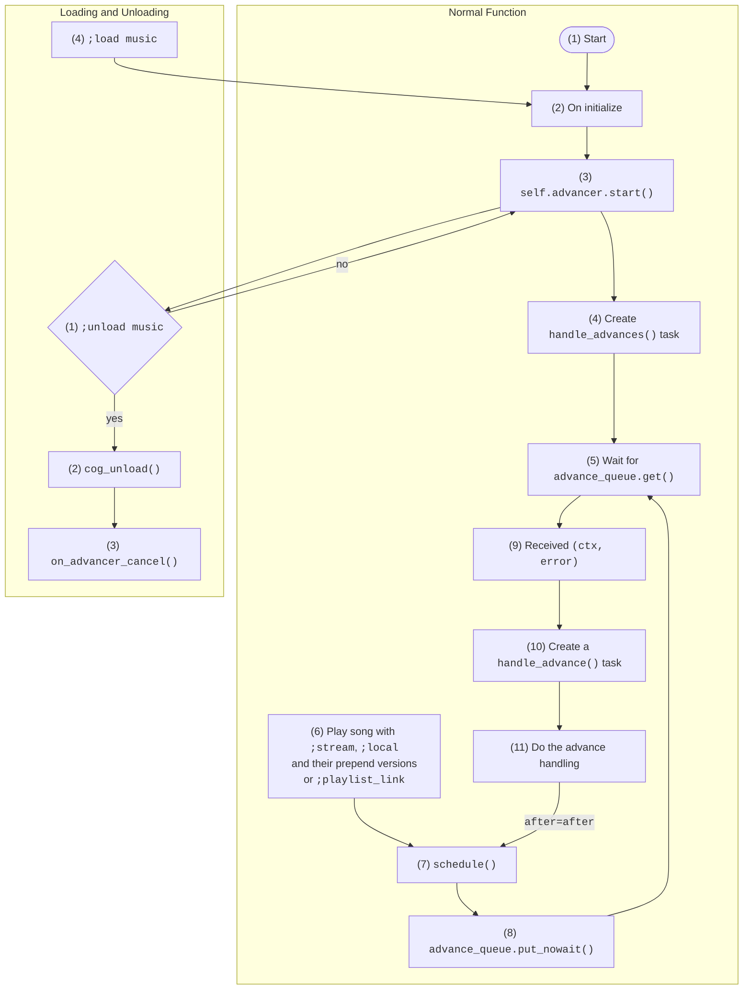

*The information may be useful for future developers looking to dig more into the inner working of the bot and for my own reference. Understanding this section requires knowledge on Python's asyncio library.*

## Flowchart

(write this last) To ensure a working queueing system that works across servers, JG Music uses a somewhat complicated music advancing method with status flags. The most important process of JGMusic (the core) is the music advancing system

The following flowchart depicts a high-level overview of the music advancing system, including a small section on what happens during [`load`]()s/[`unload`]()s.

All flowchart nodes are labelled with a number to be elaborated further on in the next sections.

## Normal Function in Detail

### (1) Start

### (2) On initialize

### (3) `self.advancer.start()`

### (4) Create `handle_advances()` task

### (5) Wait for `advance_queue.get()`

### (6) Play song with `;stream`, `;local` and their prepend versions or `;playlist_link`

### (7) Schedule

### (8) `advance_queue.put_nowait()`

### (9) Received `(ctx, error)`

### (10) Create a `handle_advance()` task

### (11) Do the advance handling

## Loading and Unloading in Detail

### (1) `;unload music`

### (2) `cog_unload()`

### (3) `on_advancer_cancel()`

### (4) `;load music`

## Extra Notes

---

The entry point of JG Music is `joshgone.py`. At this point, the extensions are loaded in. This section will focus on `music.py`'s music advancement process.

The music advancement process in short, ensures that once a song finishes playing, the next one gets played right after. (maybe come back to this later too)

(rename this to not joshgone.py later)

`jgmusic.py` calls its `main()` function, which leads to a series of calls until the `_run()` function which does the necessary setup to startup the bot. Here the `music.py` extension gets loaded.
