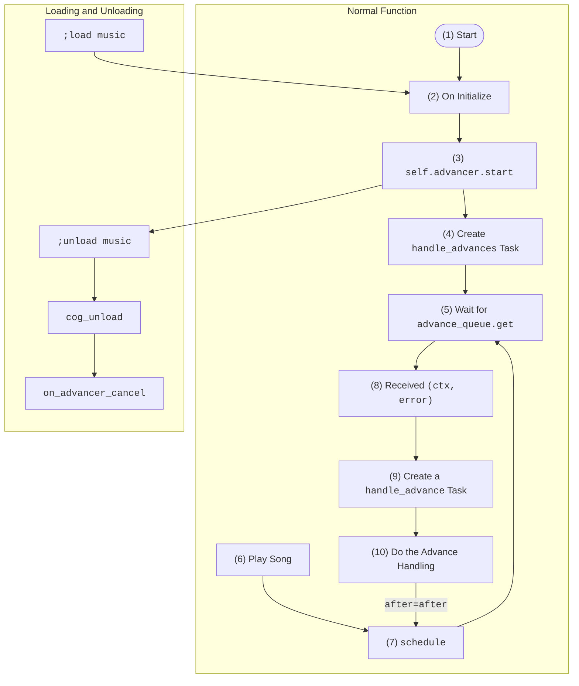

*The information may be useful for future developers looking to dig more into the inner working of the bot and for my own reference. Understanding this section requires knowledge on Python's `asyncio` library.*

## Flowchart

To ensure a working music advancing system that works across servers, JG Music at its core uses a somewhat complicated strategy involving asynchronous queues and status flags. In short, the music advancing process is the bot's preprocess-playback-repeat system.

The following flowchart depicts a high-level overview of the music advancing system, including a small section on what happens during [`load`]()s/[`unload`]()s.

All flowchart nodes are labelled with a number to be elaborated further on in the next sections.



## Normal Function in Detail

??? note

    Mentions of `music.py`, `self`, or `Music` will refer to the file `jgm/extensions/music`, unless stated otherwise.

### (1) Start

The entry point of JG Music is `jgmusic.py`. When `hatch run jgm` is executed in the terminal, a series of functions are called which eventually leads to `jgm/extensions/music.Music.setup` which is a special discord.py function that executes when an extension gets loaded with [`load_extension`](https://discordpy.readthedocs.io/en/stable/ext/commands/api.html?highlight=load_extension#discord.ext.commands.Bot.load_extension):

### (2) On Initialize

Initialization refers to the instantiation of the `Music` cog, which happens when `Music.setup` calls `return bot.add_cog(Music(bot))`:

```py title="music.py", hl_lines="7"
...
def setup(bot):
    # Suppress noise about console usage from errors
    bot._music_old_ytdl_bug_report_message = youtube_dl.utils.bug_reports_message
    youtube_dl.utils.bug_reports_message = lambda: ''

    return bot.add_cog(Music(bot))
...
```

The bot enters this state on startups and loads, which is covered [below](#loading-and-unloading-in-detail).

### (3) `self.advancer.start`

There exists the `bot` object and the `Music` cog. `Music` may be unloaded but `bot` will be available at all times. An `asyncio.Queue` object is stored in the `bot` and a copy is stored in `Music`. An `asyncio.Task` object `self.advance_task` is also stored in `Music` and is by default `None`. At the very end of the `__init__` function in `Music`, `self.advancer.start` is called, which eventually [starts](https://discordpy.readthedocs.io/en/stable/ext/tasks/index.html?highlight=start#discord.ext.tasks.Loop.start) the advancer in the event loop:

```py title="music.py" hl_lines="6 8 10 11"
        ...
        # Data is persistent between extension reloads
        if not hasattr(bot, "_music_data"):
            bot._music_data = {}
        if not hasattr(bot, "_music_advance_queue"):
            bot._music_advance_queue = asyncio.Queue()
        self.data = bot._music_data
        self.advance_queue = bot._music_advance_queue
        # Start the advancer's auto-restart task
        self.advance_task = None
        self.advancer.start()
        ...
```

`Music.advancer` is a `discord.ext.tasks.Loop` object that runs once every 15 seconds to see if an `self.advance_task` can be created. If there is an issue (`self.advance_task` will be done), this function auto-restarts the `self.advance_task` advancer:

```py title="music.py" hl_lines="3 13"
...
    # Auto-restart task for the advancer task
    @tasks.loop(seconds=15)
    async def advancer(self):
        if self.advance_task is not None and self.advance_task.done():
            try:
                exc = self.advance_task.exception()
            except asyncio.CancelledError:
                pass
            else:
                print("Exception occured in advancer task:")
                traceback.print_exception(None, exc, exc.__traceback__)
            self.advance_task = None
...
```

### (4) Create `handle_advances` Task

If `self.advance_task` is `None`, it will be set to an `asyncio.Task` (`asyncio.create_task` wrapped) `Music.handle_advances()` coroutine, otherwise known as the **music advancer**[^1]:

```py title="music.py" hl_lines="5 6 7 8 9"
    ...
    @tasks.loop(seconds=15)
    async def advancer(self):
        ...
        if self.advance_task is None:
            self.advance_task = asyncio.create_task(
                self.handle_advances(),
                name="music_advancer"
            )
    ...
```

[^1]: Space replaced with underscore in the code.

This gets put in the global `asyncio` event loop and eventually runs "soon".

### (5) Wait for `advance_queue.get`

Inside the `Music.handle_advances()` coroutine is an infinite loop that first `await`s an item from `self.advance_queue` (pauses its execution until it receives the queued item). This infinite loop is called the **music advancer task loop**:

```py title="music.py" hl_lines="4 5"
    ...
    # The advancer task loop
    async def handle_advances(self):
        while True:
            item = await self.advance_queue.get()
            asyncio.create_task(self.handle_advance(item))
    ...
```

### (6) Play Song

The way to play a song involves invoking the following commands

- `;stream`
- `;stream_prepend`
- `;local`
- `;local_prepend`
- `;playlist_link`

or directly as Python code from the [REPL](./dev.md#the-repl).

Each of these commands trigger the `Music.schedule` function.

### (7) Schedule

The `Music.schedule` function schedules advancement of the queue, provided the bot is not currently "waiting" ("waiting" is elaborated on in [(10)](#10-do-the-advance-handling)).

Within the `Music.schedule` function, the `self.advance_queue.put_nowait` function is called, which places a `(ctx, error)` tuple (see [(8)](#8-received-ctx-error)) in `self.advance_queue`. The `ctx` object is that of the most recently run bot command that calls the `Music.schedule` function. The `put_nowait` function allows an item to be added without pausing execution:

```py title="music.py" hl_lines="2 6"
    ...
    # Schedules advancement of the queue
    def schedule(self, ctx, error=None, *, force=False):
        info = self.get_info(ctx)
        if force or not info["waiting"]:
            self.advance_queue.put_nowait((ctx, error))
            info["waiting"] = True
    ...
```

As the `(ctx, error)` item is being awaited in the music advancer task loop, once an item is placed in `self.advance_queue`, the `self.advance_queue.get` function will immediately "capture" it, allowing the music advancer task loop to be unpaused from execution.

The option to force a schedule is done by running the [`;reschedule`](./additional.md#reschedule) command.

### (8) Received `(ctx, error)`

Continuing from [(6)](#6-play-song), the coroutine resumes execution after an item is obtained. This item is a tuple.

- The first element `ctx` is an `discord.ext.commands.context.Context` object
- The second element `error` is a player error that happened sometime before handling an advance.

Having a `discord.ext.commands.context.Context` object useful for fetching the user who ran the command, along with the server they are currently in, along with a lot of other useful information. This allows one `asyncio.Queue` to be used to manage multiple bot "instances" in many servers.

Player errors are quite rare under normal usage of the bot. However, the most common one is

```text
Player error: OSError(10038, 'An operation was attempted on something that is not a socket', None, 10038, None)
```

Technically, the code is completely functional if the second element was removed. It is kept for clarity and ease of debugging.

### (9) Create a `handle_advance` Task

Continuing from [(8)](#8-received-ctx-error), the execution of the music advancer task loop (`Music.handle_advances()` coroutine) resumes. An `asyncio.Task` is created around the `Music.handle_advance()` coroutine, which performs all the music advancing logic:

```py title="music.py" hl_lines="4"
    ...
        while True:
            item = await self.advance_queue.get()
            asyncio.create_task(self.handle_advance(item))
    ...
```

This task is created with the `(ctx, error)` item returned by `self.advance_queue.get` and will eventually get executed after being placed in the global event loop.

### (10) Do the Advance Handling

Inside the `Music.handle_advance()` coroutine, the **music advancing logic** first go through many sanity/error checks, then plays the songs, and automatically sets up to run the `Music.schedule()` coroutine after playing the song.

#### Status Flags

There are 2 flags that control the state of the bot, located in the `Music.data` dictionary. For each server, a specified "state dictionary" (we call this `info`) is obtained through a call to `self.get_info(ctx)`. These 2 flags are

- `info["processing"]`, can be `True` or `False`
- `info["waiting"]`, can be `True` or `False`

`info["waiting"]` is `True` right after `self.advance_queue.put_nowait` put an item in `self.advance_queue` when `Music.schedule()` is run (then proceeds to handle the advancement). It gets set to `False` when the music advancing logic runs into exception or the advancing logic finishes:

```py title="music.py" hl_lines="4 8"
        ...
        except Exception as e:
            await channel.send(f"Internal Error: {e!r}")
            info["waiting"] = False
            await self.skip(ctx)
            self.schedule(ctx)
        finally:
            info["waiting"] = False
            info["processing"] = False
        ...
```

It is usually not possible to reset or interrupt the music advancing logic, but when something breaks that causes the bot to hang, a `;reschedule` may be required.

`info["processing"]` is mostly `False`, but can be `True` if something unexpected happens, usually high latency. Spamming the `;reschedule` command is likely to trigger this response as well, because one way to go back to the beginning of the music advancing logic with `info["processing"] == True` is to force a schedule at the perfect time:

```py title="music.py" hl_lines="7 12"
    ...
    # The actual music advancing logic
    async def handle_advance(self, item):
        ...
        try:
            # If we are processing it right now...
            if info["processing"]:
                # Wait a bit and reschedule it again
                await asyncio.sleep(1)
                self.advance_queue.put_nowait(item)
                return
            info["processing"] = True
    ...
```

Basically, "processing" spans the entirety of the music advancing logic, but covers slightly less time than "waiting" because it has some queue conflict system built into it.

Togging of `True`/`False` of `info["processing"]` only happens in the music advancing logic.

??? Note

    If it ever so happens that `info["processing"] = True` when the music advancing logic starts, there are is a line of code: `await asyncio.sleep(1)` in a previous block that force the music advancing logic to pause for a second before continuing. This is done to prevent two `(ctx, error)` tuples in `self.advance_queue` from continually kicking each other out, which may happen through quick reschedules, or if the bot is very laggy while the computer is very fast. In practice, this should never happen.

Summary, in general:

| Waiting | Processing | When           |
|---------|------------|----------------|
| `True`  | `True`     | Almost always going into the music advancing logic, except for a split second at the very beginning |
| `True`  | `False`    | The opposite of the above, in a split second at the very beginning of the music advancing logic |
| `False` | `True`     | Almost never happens |
| `False` | `False`    | When bot exits the music advancing logic and starts playing the song |

The table accounts for 99% of all cases. The remaining 1% originates is deemed to be unexpected behaviour, once again usually fixable with a `;reschedule` and in the worse case, a restart.

#### Setup After Playing

If there are more than 0 songs in the actual playback queue, right when the playback of a song has ended, the kwarg `after=after` in [`ctx.voice_client.play`](https://discordpy.readthedocs.io/en/stable/api.html?highlight=play#discord.VoiceClient.play) will run the `Music.schedule()` coroutine as `after` (the argument) is set to `lambda error, ctx=ctx: self.schedule(ctx, error)`, ensuring that there is an item in `self.advance_queue` to be "picked up" when looping back to the beginning of the while loop in `Music.handle_advance` in [(5)](#5-wait-for-advance_queueget):

```py title="music.py" hl_lines="7 12"
            ...
            if queue:
                # Get the next song
                current = queue.popleft()
                info["current"] = current
                # Get an audio source and play it
                after = lambda error, ctx=ctx: self.schedule(ctx, error)
                async with channel.typing():
                    ...
                    ctx.voice_client.pause()
                    ctx.voice_client.play(source, after=after)
                await channel.send(f"Now playing: {title}")
            ...
```

If there are 0 songs in the actual playback queue, then the `Music.handle_advance()` will skip the part where `after=after` is added to the `ctx.voice_client.play` function (unless if some Internal Error occurs). This results in the code returning to [(5)](#5-wait-for-advance_queueget) and hanging until [(6)](#6-play-song) happens.

## Loading and Unloading in Detail

The bot was designed to be reloadable for ease of development. However loading and unloading when the bot is running may cause unexpected behaviour at times.

When unloading with `;unload music`, a special function `cog_unload`

```py title="music.py" hl_lines="4"
    ...
    # Cancel just the advancer and the auto-restart tasks
    def cog_unload(self):
        self.advancer.cancel()
    ...
```

is called. This cancels the advancer/monitoring task (that runs once ever 15 seconds). In turn, this cancels the music advancer and sets `self.advance_task` to `None`:

```py title="music.py" hl_lines="6 7"
    ...
    @advancer.after_loop
    async def on_advancer_cancel(self):
        if self.advancer.is_being_cancelled():
            if self.advance_task is not None:
                self.advance_task.cancel()
                self.advance_task = None
    ...
```

Upon unloading, the important instance variables that "disappear" are:

- `Music.data`
- `Music.advance_queue`
- `Music.advance_task`

However, when `;load music` is performed, the first 2 variables on the list are set to references stored in the global bot object, while the third one gets set to a new music advancer with the same functionality. In short, loading the music cog brings the bot back to [(2)](#2-on-initialize).
